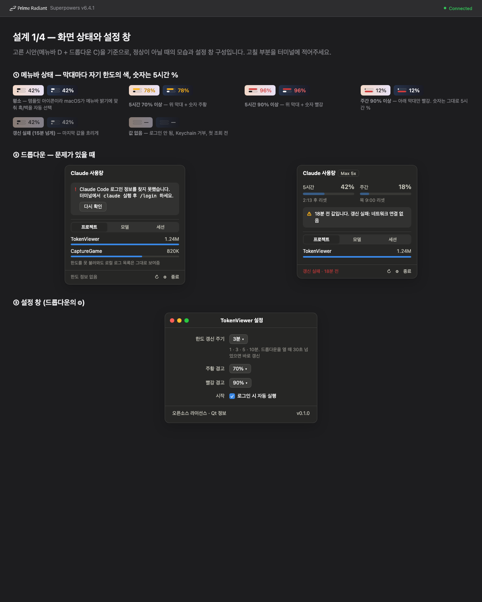
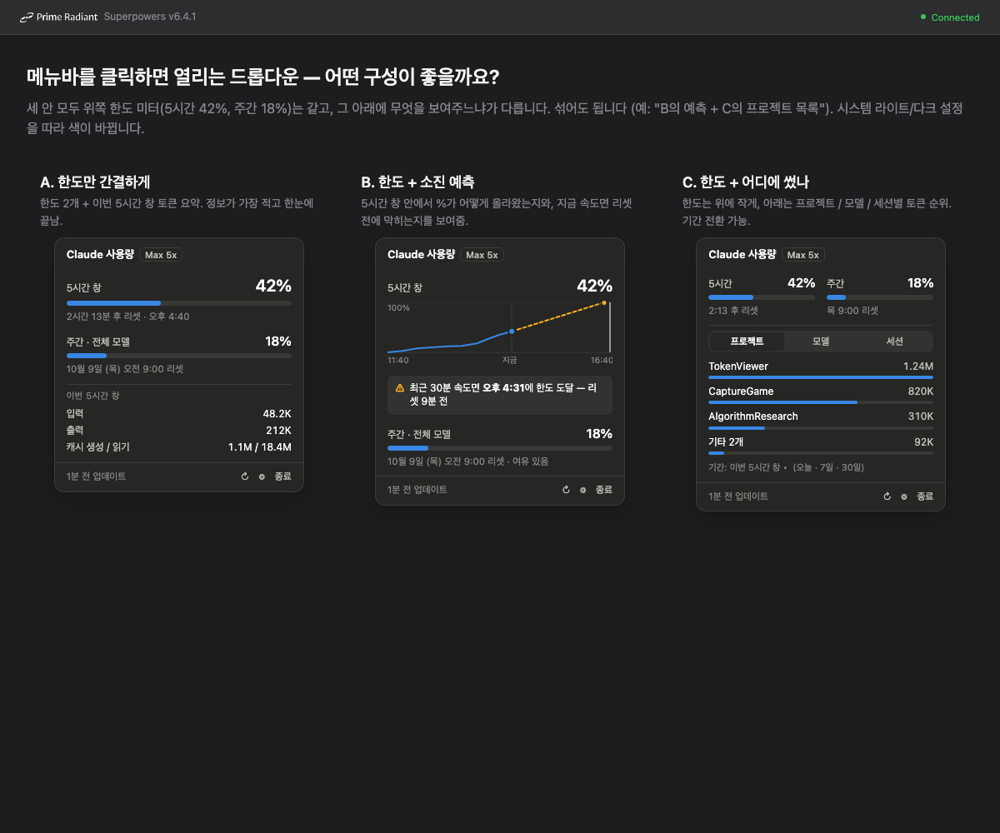

# TokenViewer 설계

- 작성일: 2026-10-05
- 상태: 구현 완료 (v0.1.0)
- 대상 플랫폼: macOS 26 (개발 PC), Qt 5.15 (LGPLv3), C++

## 1. 목적

macOS 상단 메뉴바에서 **Claude Code 요금제 한도(Pro/Max)에 얼마나 다가갔는지**를 항상 보여 준다.
클릭하면 한도의 상세(리셋 시각)와, 로컬 세션 로그로 계산한 **어디에 썼는지**(프로젝트·모델·세션별 API 환산 비용)를 보여 준다.

**성공 기준**

1. 메뉴바 숫자가 Claude Code `/usage` 의 5시간 % 와 같다 (갱신 주기 안에서).
2. Claude Code 가 꺼져 있어도 한도 값이 갱신된다.
3. 한도를 못 불러와도 로컬 로그 기반 목록은 보인다.
4. 앱이 Claude Code 의 로그인 상태를 절대 바꾸지 않는다 (토큰을 읽기만 한다).

**범위 밖**

- macOS 알림(알림 센터). 메뉴바 색 변화로 대신한다.
- 토큰 직접 갱신(refresh). Claude Code 의 로그인을 깨뜨릴 수 있다.
- Windows/Linux, API 키·Bedrock·Vertex 사용자 (한도 개념이 없다).
- 기간 비교 차트, 소진 예측 (드롭다운 B안, 채택하지 않음).

## 2. 화면

### 2.1. 메뉴바 항목 (D안)

막대 2줄 아이콘 + 5시간 %. 위 막대 = 5시간 창, 아래 막대 = 주간(전체 모델).

| 상태 | 표시 |
| --- | --- |
| 평소 | 템플릿 이미지. macOS 가 메뉴바 밝기에 맞춰 흑/백을 고른다 |
| 5시간 ≥ 주황 임계치(기본 70%) | 위 막대 + 숫자 주황 (밝은 메뉴바 `#c98500`, 어두운 메뉴바 `#fab219`) |
| 5시간 ≥ 빨강 임계치(기본 90%) | 위 막대 + 숫자 빨강 (밝은 메뉴바 `#d03b3b`, 어두운 메뉴바 `#ff6b6b`) |
| 주간 ≥ 임계치 | 아래 막대만 같은 규칙으로 색칠. 숫자는 항상 5시간 % |
| 갱신 실패가 15분 넘게 이어짐 | 마지막 값을 50% 투명도로 |
| 값 없음 (로그인 안 됨, Keychain 거부, 첫 조회 전) | 빈 막대 + `—`, 50% 투명도 |

- 막대: 폭 22pt, 높이 4pt, 간격 2pt, 끝 2pt 둥글게. 빈 부분은 외곽선만.
- 숫자: 시스템 글꼴 13pt.
- 클릭하면 드롭다운을 열고, 다시 클릭하거나 바깥을 누르면 닫는다. 우클릭 메뉴는 없다.



### 2.2. 드롭다운 (C안)

폭 300pt, 높이는 내용에 맞춘다. 시스템 라이트/다크를 따른다.

1. **머리**: `Claude 사용량` + 요금제 배지(예: `Max 5x`, 알 수 없으면 숨김).
2. **한도**: 5시간 / 주간 미터를 나란히. 각 미터는 % (15pt, 굵게), 6pt 막대, `2:13 후 리셋` 또는 `목 9:00 리셋`.
   미터 색 규칙은 메뉴바와 같다 (평소 파랑 `#2a78d6` / 다크 `#3987e5`).
3. **어디에 썼나**: 세그먼트 `프로젝트 | 모델 | 세션` + 기간 선택 `이번 5시간 창 | 오늘 | 7일 | 30일`.
   상위 5개 + `기타 N개` 한 줄. 각 줄은 이름, API 환산 금액(`$12.40`), 1위 대비 막대.
   줄에 마우스를 올리면 툴팁으로 입력/출력/캐시 쓰기/캐시 읽기 토큰 수를 보여 준다.
   고른 탭과 기간은 기억한다.
4. **바닥**: `n분 전 업데이트` (실패 시 빨간 `갱신 실패 · n분 전`), 새로고침 ↻, 설정 ⚙, 종료.

문제가 있을 때(2.1 그림의 ②):

- 로그인 정보 없음: 한도 자리에 안내 (`터미널에서 claude 실행 후 /login`) + `다시 확인` 버튼.
- 갱신 실패: 마지막 값을 흐리게 두고 `18분 전 값입니다. 갱신 실패: <이유>` 안내.
- 두 경우 모두 3번 목록은 그대로 보인다.

비교했던 안: 
(목업의 C안은 토큰 수를 보여 주지만, 확정안은 API 환산 금액을 보여 준다. 5.5절)

### 2.3. 설정 창

| 항목 | 값 | 기본 |
| --- | --- | --- |
| 한도 갱신 주기 | 1 · 3 · 5 · 10분 | 3분 |
| 주황 경고 | 50–95%, 5% 단위 | 70% |
| 빨강 경고 | 주황보다 큰 값, 5% 단위 | 90% |
| 로그인 시 자동 실행 | 체크 | 켬 |

바닥에 `오픈소스 라이선스 · Qt 정보` 와 버전. LGPL 고지 의무 때문에 필수다 (`docs/LicenseCompliance.md`).

## 3. 데이터 소스

### 3.1. 한도: Anthropic 사용량 API (비공식)

- `GET https://api.anthropic.com/api/oauth/usage`
- 헤더: `Authorization: Bearer <accessToken>`, `anthropic-beta: oauth-2025-04-20`
- 응답 형태 (2026-10-05 실제 응답으로 확인, `docs/superpowers/notes/2026-10-05-usage-api-probe.md`):
  `five_hour.utilization` (0–100), `five_hour.resets_at`, `seven_day.utilization`, `seven_day.resets_at`.
- 파서는 관대하게 만든다: `%` 필드는 `utilization` 또는 `used_percentage`, `resets_at` 은 ISO 8601 문자열 또는 epoch 초 둘 다 받는다. 필드가 없거나 `null` 이면 그 미터만 비운다.
- 공식 문서에 없는 API 라서 바뀔 수 있다. 바뀌면 "응답 형식이 바뀌었습니다" 상태가 되고 로그 목록은 계속 동작한다.

### 3.2. 토큰: Claude Code 로그인 정보

- 1순위: Keychain generic password, 서비스 이름 `Claude Code-credentials`. Security.framework C API (`SecItemCopyMatching`) 로 읽는다.
- 2순위: `~/.claude/.credentials.json`.
- 내용 (2026-10-05 확인, `expiresAt` 은 epoch ms): `claudeAiOauth.accessToken`, `expiresAt`, `subscriptionType`, `rateLimitTier`.
- `expiresAt` 이 지났으면 API 를 부르지 않고 "토큰 만료" 상태로 둔다.
- **refreshToken 은 읽지도 쓰지도 않는다.** 앱이 토큰을 갱신하면 토큰 회전 때문에 Claude Code 로그인이 풀릴 수 있다.

### 3.3. 어디에 썼나: 로컬 세션 로그

- 위치: `~/.claude/projects/**/*.jsonl`, 하위 `<sessionId>/subagents/agent-*.jsonl` 포함.
- 2026-10-05 기준 실측: 파일 541개(그중 subagent 494개), 1.25GB, usage 줄 65,164 → 중복 제거 후 30,770건.
  subagent 파일이 usage 줄의 63% 라서 빼면 사용량이 절반 이하로 보인다.
- Claude Code 가 30일 지난 로그를 지우므로 30일이 최대 기간이다.

## 4. 구조

### 4.1. 구성 요소

```
                         ┌──────────────── Application (모두 소유) ───────────────┐
                         │                                                       │
  Keychain ──► CredentialStore ─┐                                                │
                                ├─► UsageFetchThread ──┐                         │
  api.anthropic.com ◄── UsageApiClient ─┘  (주기 / 열 때)  │                         │
                                                       ▼                         │
                                              SystemStatus + Observers ◄─────────┤
                                                       ▲        │ signal         │
  ~/.claude/projects/**/*.jsonl ──► LogScanThread ─────┘        ▼                │
                     (LogParser → TokenAggregator)     TrayIcon ── UsagePopup ── SettingsDialog
                                                      (TrayIconPainter)
```

| 단위 | 하는 일 | 의존 |
| --- | --- | --- |
| `Application` | 모든 모듈을 `std::unique_ptr` 로 소유하고 연결한다 | 전부 |
| `Observers` | UI 간 signal (`LimitsUpdated`, `LimitsFailed`, `BreakdownUpdated`, `SettingsChanged`, `RefreshRequested`) | QObject |
| `SystemStatus` | 현재 상태: 한도 값, 마지막 성공 시각, 마지막 오류, 집계 결과 | — |
| `Settings` | `QSettings` 래퍼 (2.3 항목 + 마지막 탭·기간) | QtCore |
| `CredentialStore` | 3.2 규칙으로 accessToken·요금제를 읽는다 | Security.framework |
| `UsageApiClient` | 3.1 호출과 응답 → `UsageLimits` | QtNetwork |
| `UsageFetchThread` | 위 둘을 백그라운드에서 실행. Keychain 허용 창이 떠 있는 동안 UI 가 멈추면 안 된다 | — |
| `LogParser` | jsonl 한 줄 → `TokenRecord` 또는 "해당 없음" | 순수 함수 |
| `PriceTable` | 모델 + 토큰 종류 → 금액. 가격은 리소스 JSON 에서 읽는다 | 순수 |
| `TokenAggregator` | 레코드 + 기간 + 기준(프로젝트/모델/세션) → 순위 목록 | 순수 함수 |
| `LogScanThread` | 파일별 읽은 위치를 기억하고 새로 붙은 부분만 읽는다. 60초마다 | 위 셋 |
| `TrayIconPainter` | 한도 값 + 임계치 + stale 여부 → 아이콘 이미지 | 순수 (QPainter) |
| `TrayIcon` | `QSystemTrayIcon`. 클릭 → 팝업 토글 | QtWidgets |
| `UsagePopup` | 2.2 드롭다운. 프레임 없는 `Qt::Popup` 창을 트레이 아이콘 바로 아래에 띄운다 | QtWidgets |
| `SettingsDialog`, `LicenseNoticesDialog` | 2.3 설정 창, 라이선스 고지 | QtWidgets |
| `LoginItem` | `~/Library/LaunchAgents/<bundle id>.plist` 를 쓰거나 지운다 | — |

- 스레드는 `docs/Qt.md` 의 Worker + `moveToThread` + PIMPL 패턴, 한 파일에 한 스레드.
- UI 는 `SystemStatus` 를 읽고 `Observers` signal 에 반응만 한다.
- 대안 구현이 없으므로 `docs/Patterns.md` 의 Strategy 패턴과 CPU/GPU 분리는 쓰지 않는다.

### 4.2. 폴더

```
CMakeLists.txt
src/
  main.cpp
  Core/       Application, Observers, SystemStatus, Settings
  Model/      UsageLimits.h, TokenRecord.h, Breakdown.h
  Service/    CredentialStore, UsageApiClient, LoginItem
  Thread/     UsageFetchThread, LogScanThread
  Analysis/   LogParser, PriceTable, TokenAggregator
  UI/         TrayIcon, TrayIconPainter, UsagePopup, LimitMeterWidget,
              BreakdownListWidget, SettingsDialog, LicenseNoticesDialog
resources/    prices.json, THIRD_PARTY_NOTICES.md, Info.plist.in, TokenViewer.qrc
tests/        Analysis·Service 파서·TrayIconPainter 단위 테스트, fixtures/
```

### 4.3. 빌드·배포

- CMake + Ninja, Qt 5.15 (Core, Gui, Widgets, Network, Test). Qt Charts 등 GPL 전용 모듈은 쓰지 않는다.
- macOS 앱 번들, `Info.plist` 에 `LSUIElement=true` (Dock 아이콘 없음). 번들 ID 는 `com.tokenviewer.TokenViewer`.
- 링크: Security.framework + CoreFoundation (C API 만, Objective-C 없음. 9절 스파이크가 실패하면 `TrayIcon` 에 한해 Objective-C++ 와 AppKit 추가).
- 아이콘·그림은 코드로 그린다. 외부 에셋 없음.
- 배포 규칙은 `docs/LicenseCompliance.md` 를 따른다 (동적 링크, `macdeployqt`, 고지 화면).

## 5. 데이터 규칙

### 5.1. 줄 고르기

- `"usage"` 문자열이 없는 줄은 JSON 파싱 전에 버린다.
- `type == "assistant"` 이고 `message.usage` 가 있는 줄만 쓴다. `message.model == "<synthetic>"` 은 버린다.
- 세션 이름용으로 `type == "ai-title"` 줄(`aiTitle`, `sessionId`)도 읽는다.

### 5.2. 중복 제거

- 키 = (`message.id`, `requestId`). 스트리밍 때문에 같은 응답이 2–5번 기록된다. 마지막 줄을 쓴다.

### 5.3. 귀속

| 기준 | 규칙 |
| --- | --- |
| 프로젝트 | `cwd` 의 마지막 폴더명. 이름이 같은 다른 경로가 있으면 `상위/이름` 으로 구분 |
| 세션 | `sessionId`. subagent 파일은 폴더명의 부모 세션에 합산. 이름은 가장 최근 `aiTitle`, 없으면 `프로젝트 · 10/5 14:27` (첫 레코드 시각) |
| 모델 | `claude-opus-5-5` → `Opus 5.5` 처럼 표시. 모르는 모델은 ID 그대로 |

### 5.4. 기간

| 기간 | 시작 |
| --- | --- |
| 이번 5시간 창 | API 의 `five_hour.resets_at − 5시간`. API 값이 없으면 지금 − 5시간 |
| 오늘 | 로컬 자정 |
| 7일 / 30일 | 지금 − 7일 / 30일 |

레코드 시각은 줄의 `timestamp` (UTC) 를 쓴다.

### 5.5. API 환산 금액

금액 = Σ 토큰 × 단가. 단가는 `resources/prices.json` (2026-09-25 claude-api 참조 기준, USD / 1M 토큰):

| 모델 | 입력 | 출력 | 캐시 쓰기 5분 / 1시간 | 캐시 읽기 |
| --- | --- | --- | --- | --- |
| `claude-fable-5-1` | 10 | 50 | 12.5 / 20 | 0.25 |
| `claude-fable-5` | 10 | 50 | 12.5 / 20 | 1.00 |
| `claude-opus-5-5` | 4 | 20 | 5 / 8 | 0.20 |
| `claude-opus-5` | 5 | 25 | 6.25 / 10 | 0.50 |
| `claude-sonnet-5-5` | 2 | 10 | 2.5 / 4 | 0.20 |
| `claude-sonnet-5` | 2 | 10 | 2.5 / 4 | 0.20 |
| `claude-haiku-4-5*` | 1 | 5 | 1.25 / 2 | 0.10 |

- 캐시 쓰기는 `usage.cache_creation.ephemeral_5m_input_tokens` / `ephemeral_1h_input_tokens` 로 나눈다. 없으면 `cache_creation_input_tokens` 전체를 5분으로 본다.
- `usage.speed == "fast"` 이면 2배 (Opus 5.5 fast mode).
- 표에 없는 모델은 같은 계열(fable/opus/sonnet/haiku)의 첫 행 가격을 쓰고 금액 앞에 `≈` 를 붙인다. 계열도 모르면 금액 없이 토큰만 보여 준다.
- 실측: 중복 제거 후 토큰의 97% 가 캐시 읽기다. 그래서 단순 토큰 합 대신 금액으로 순위를 낸다.

## 6. 갱신 정책

| 대상 | 언제 |
| --- | --- |
| 한도 | 앱 시작, 설정 주기(기본 3분), 드롭다운을 열 때 마지막 시도가 30초 넘었으면, ↻ 버튼 |
| 로그 | 앱 시작 시 전체(30일 이내 수정된 파일만), 이후 60초마다 증분, 드롭다운을 열 때 |
| 메뉴바 아이콘 | 한도·임계치·stale 상태가 바뀔 때만 다시 그린다 |
| `n분 전` 표시 | 드롭다운이 열려 있을 때 30초마다 |

## 7. 오류 처리

| 상황 | 동작 | 메뉴바 |
| --- | --- | --- |
| Keychain 항목 없음, 파일도 없음 | "로그인 필요" 안내 | `—` |
| Keychain 접근 거부/취소 | **자동 재시도 안 함** (매번 허용 창이 뜬다). `다시 확인` 을 눌렀을 때만 | `—` |
| 토큰 만료 (`expiresAt` 지남) 또는 401 | "Claude Code 를 실행하면 갱신됩니다". 다음 주기마다 Keychain 을 다시 읽는다 | 마지막 값, 15분 뒤 흐리게 |
| 429 | 갱신 주기를 2배씩, 최대 30분. 성공하면 원래대로 | 같음 |
| 네트워크 오류, 5xx, 타임아웃(10초) | 다음 주기에 재시도 | 같음 |
| 응답 JSON 파싱 실패, 필수 필드 없음 | "응답 형식이 바뀌었습니다". 원문을 `~/Library/Logs/TokenViewer/` 에 남김 | `—` |
| 로그 마지막 줄이 쓰다 만 상태 | 마지막 완전한 줄바꿈까지만 읽고 위치를 거기에 둔다 | — |
| 로그 파일이 작아짐/사라짐 | 그 파일을 처음부터 다시 읽거나 기록에서 뺀다 | — |
| 로그 한 줄 파싱 실패 | 그 줄만 건너뛴다 | — |

**보안**: 액세스 토큰은 요청하는 동안만 메모리에 둔다. 로그·파일·설정에 쓰지 않는다. 오류 로그에 남기는 응답 원문에도 토큰은 없다.

## 8. 테스트

Qt Test, 실제 API·Keychain 호출 없음.

| 대상 | 확인할 것 |
| --- | --- |
| `LogParser` | 실제 로그에서 익명화한 fixture: 정상 assistant 줄, 중복, `<synthetic>`, subagent 경로, `ai-title`, 깨진 줄 |
| `TokenAggregator` | 기간 경계 (자정, 5시간 창 시작), 중복 제거, subagent 합산, 기타 N개 접기, 동명 프로젝트 |
| `PriceTable` | 모델별 금액, 1시간 캐시, fast, 계열 대체(`≈`), 모르는 계열 |
| `UsageApiClient` 파서 | 정상 응답, `used_percentage` 변형, epoch `resets_at`, 필드 없음, `null` |
| `CredentialStore` 파서 | credentials JSON 정상/필드 없음/만료 |
| `TrayIconPainter` | `QImage` 로 그려 막대 영역 픽셀 색과 폭(%)을 확인, 템플릿 여부 |

수동 확인 목록: macOS 26 밝은/어두운 배경화면에서 아이콘, 클릭, 다중 모니터에서 팝업 위치, Keychain 허용 창, 로그인 시 자동 실행.

## 9. 위험과 첫 작업

**첫 작업 = 확인 작업(스파이크).** 구현 계획의 맨 앞에 둔다.

1. `TrayIconPainter` + `TrayIcon` 최소 구현으로 Qt 5.15.2 가 macOS 26 에서
   - 가로로 긴 아이콘을 잘리지 않게 그리는지,
   - 템플릿 이미지가 메뉴바 밝기에 맞춰 바뀌는지,
   - 클릭이 `activated(Trigger)` 로 들어오는지,
   - 주황/빨강 상태(비템플릿 이미지)에서 나머지 막대·외곽선 색을 메뉴바 밝기에 맞출 수 있는지 확인한다.
   하나라도 안 되면 `TrayIcon` 만 `NSStatusItem` 을 쓰는 Objective-C++ 구현으로 바꾼다 (버튼의 `effectiveAppearance` 로 밝기를 안다). 나머지 단위는 그대로다.
2. 사용자 동의를 받고 실제 `/api/oauth/usage` 를 한 번 불러 응답 필드(3.1)와 credentials 구조(3.2)를 확정한다. 토큰은 출력하지 않는다.

**남는 위험**

- 비공식 API 변경: 파서를 관대하게 만들고, 깨지면 로그 목록만으로도 쓸 수 있게 둔다.
- Keychain 허용 창 반복: Claude Code 가 토큰을 갱신하며 Keychain 항목을 다시 만들면 접근 권한이 초기화될 수 있다. 개발 중에는 다시 빌드할 때마다 서명이 바뀌어 창이 다시 뜬다. 스파이크에서 빈도를 본다.
- Qt 5.15.2 노후: macOS 26 에서 팝업 그림자·둥근 모서리가 다르게 보일 수 있다. 기능에는 영향 없음.
